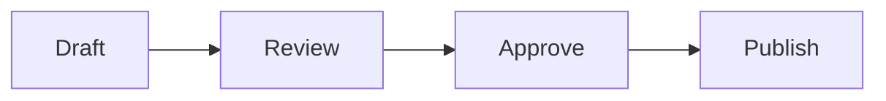

# Markdown Feature Demo

A polished sample document for testing Markdown renderers, terminal output, and styling rules.

> [!NOTE]
> This file intentionally uses many Markdown and GitHub Flavored Markdown (GFM) features in one place.

## Table of Contents

1. [Headings and Text](#headings-and-text)
2. [Lists and Task Lists](#lists-and-task-lists)
3. [Links and Images](#links-and-images)
4. [Blockquotes and Callouts](#blockquotes-and-callouts)
5. [Code and Syntax Highlighting](#code-and-syntax-highlighting)
6. [Tables](#tables)
7. [Footnotes and References](#footnotes-and-references)
8. [Math, HTML, and Extras](#math-html-and-extras)
9. [Escaping and Literal Text](#escaping-and-literal-text)

---

## Headings and Text

### Heading Level 3

#### Heading Level 4

##### Heading Level 5

###### Heading Level 6

This paragraph contains **bold**, *italic*, ***bold italic***, ~~strikethrough~~, and `inline code`.

You can also combine styles like **bold with `code` inside** and links like [inline links](https://example.com).

Line break examples:
First line with two trailing spaces.  
Second line after a hard break.

First paragraph in a logical section.

Second paragraph separated by a blank line.

---

## Lists and Task Lists

### Unordered List

- Project kickoff complete
- Documentation drafted
- Review items:
  - Confirm release date
  - Confirm owner for QA
  - Confirm rollout checklist

### Ordered List

1. Define scope
2. Build prototype
3. Run validation
4. Publish notes

### Mixed List

1. Sprint 1
   - API contract
   - Error model
2. Sprint 2
   - UI polish
   - Accessibility checks

### Task List

- [x] Create initial brief
- [x] Add code samples
- [ ] Final legal review
- [ ] Publish release blog

### Definition List (supported by some parsers)

Term A
: Short definition for term A.

Term B
: First detail line.
: Second detail line.

---

## Links and Images

Inline link: [Project homepage](https://example.com "Example title")

Autolink: <https://github.com>

Email autolink: <team@example.com>

Reference-style link: [Release playbook][playbook]


Image wrapped in a link:
[](https://example.com/docs)

---

## Blockquotes and Callouts

> A clear release note is better than a long release note.
>
> - Engineering Handbook

> [!TIP]
> Keep checklists short and observable.

> [!WARNING]
> Do not deploy irreversible data migrations without a rollback plan.

Nested quote:

> Quarter goals
> > Stability first
> > Improve developer feedback loops

---

## Code and Syntax Highlighting

Inline command: `catmd DEMO.md`

```bash
# Build and run
cargo build
cargo run -- DEMO.md
```

```rust
fn summarize(name: &str, tasks_done: usize) -> String {
    format!("{name} completed {tasks_done} tasks")
}

fn main() {
    println!("{}", summarize("Avery", 7));
}
```

```json
{
  "name": "catmd-demo",
  "version": "1.0.0",
  "features": ["tables", "code", "footnotes"]
}
```

```diff
- status: pending
+ status: shipped
```

```text
Plain text block without syntax highlighting.
Useful for logs or command output.
```

---

## Tables

| Milestone | Owner | Due Date   | Status      |
| :-------- | :---- | :--------- | :---------- |
| Spec      | Rina  | 2026-03-10 | Complete    |
| MVP       | Omar  | 2026-03-20 | In Progress |
| Launch    | Kai   | 2026-04-02 | Planned     |

| Left aligned | Center aligned | Right aligned |
| :----------- | :------------: | ------------: |
| alpha        |      beta      |           100 |
| gamma        |      delta     |           250 |

---

## Footnotes and References

Markdown can include footnotes for extra context.[^footnote-1]

Another note can clarify assumptions.[^assumption]

Reference shortcuts can keep paragraphs cleaner.[playbook]

---

## Math, HTML, and Extras

Inline math (if supported): $E = mc^2$

Block math (if supported):

$$
\int_{0}^{1} x^2\,dx = \frac{1}{3}
$$

<details>
  <summary>Expandable HTML details block</summary>

  This section uses raw HTML to collapse long content.

  - Useful for verbose notes
  - Works in many Markdown renderers

</details>

<kbd>Ctrl</kbd> + <kbd>C</kbd> to stop a running command.

<sub>Subscript text</sub> and <sup>superscript text</sup> via inline HTML.

Mermaid diagram (if supported):



---

## Escaping and Literal Text

Use backslashes to escape Markdown punctuation:

\*not italic\*  
\[not a link\](https://example.com)  
\# not a heading

Literal pipes inside a table cell can be escaped like `\|`.

Literal HTML can be displayed by fencing it:

```html
<div class="note">Rendered as code, not HTML.</div>
```

---

## Final Notes

This demo aims to be practical, readable, and broad enough for renderer smoke tests.

If your renderer does not support every extension, that is normal; unsupported constructs should degrade gracefully.

[playbook]: https://example.com/release-playbook "Release playbook"
[^footnote-1]: Footnotes help keep the main text concise.
[^assumption]: Assumption: release approval arrives before the freeze window.
